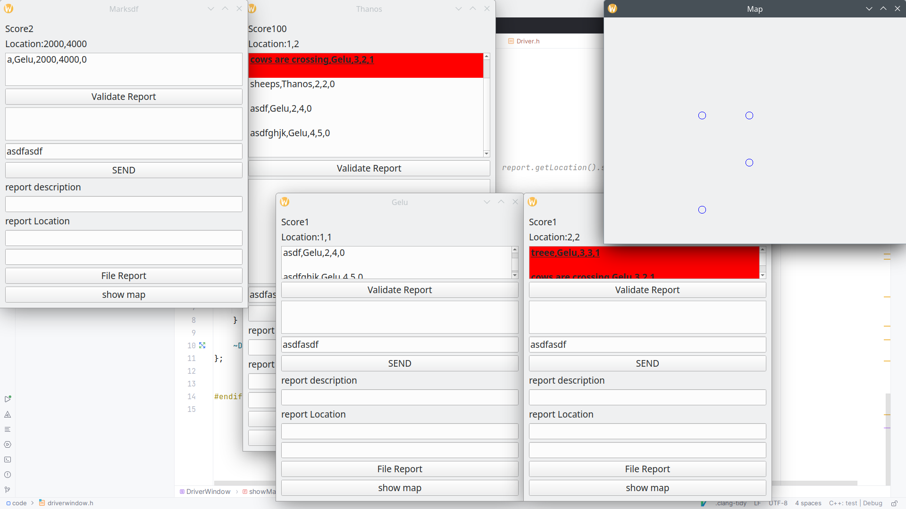

# Drivers Qt

This application's purpose is to provide a GUI for managing road reports made by drivers.

It was made using the QT framework with C++ and structured using layerd architecture principles.

It provides windows for drivers. The live synchronisation between all the openened windows is done using the Obsserver design pattern.

In this screenshot 'Gelu', 'Nelu', 'Marksd' and 'Thanos' have each a dedicated windows which allows them to file reports about the road.
Each report will contain the drivers position and will be shown in a drivers window if it is near that driver(closer than 10m). 
Drivers are able to validate other drivers reports.

All the data shown in these windows is read and then updated into the files 'drivers.in' and 'reports.in'.

There is also another window provided which is the "Map". This window shows circles in positions corresponding to the position where a report would've been filed.

